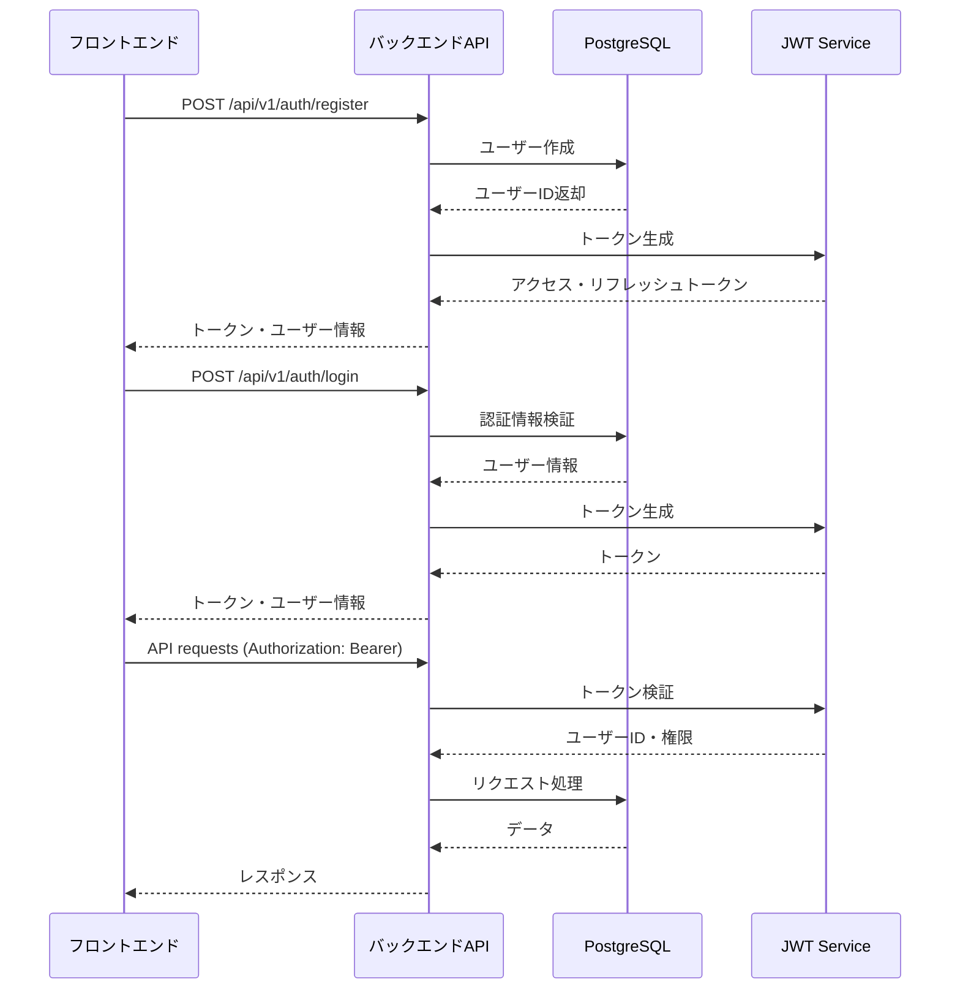

# JWT認証システム設計書

## 概要

myJarvisプロジェクトにおける包括的なJWT認証システムの設計書です。現在のtest-user仮実装を置き換え、セキュアで実用的な認証基盤を構築します。

## 🚨 現在の課題

### 緊急解決事項
- **外部キー制約エラー**: `calendar_events_userId_fkey` 制約違反
- **仮ユーザー実装**: `test-user` (`cmg2w1nvv000277gwt71j8eqa`) による暫定対応
- **セキュリティリスク**: 認証なしでの全API アクセス可能

## 🏗️ アーキテクチャ設計

### 認証フロー


## 🔒 セキュリティ要件

### JWT実装仕様
```typescript
interface JWTPayload {
  userId: string;
  email: string;
  role: UserRole;
  iat: number;    // issued at
  exp: number;    // expiration
  jti: string;    // unique token ID
}

interface TokenPair {
  accessToken: string;   // 15分有効
  refreshToken: string;  // 7日有効
}
```

### セキュリティ設定
- **アクセストークン有効期限**: 15分
- **リフレッシュトークン有効期限**: 7日
- **パスワードハッシュ**: bcrypt (rounds: 12)
- **JWT署名**: RS256 (非対称暗号化)
- **トークンローテーション**: リフレッシュ時に新トークン発行

## 📋 実装計画

### Phase 1: バックエンド認証基盤

#### 1.1 認証モデル拡張
```typescript
// backend/prisma/schema.prisma 拡張
model User {
  id              String          @id @default(cuid())
  email           String          @unique
  name            String?
  passwordHash    String          // 新規追加
  role            UserRole        @default(USER) // 新規追加
  emailVerified   DateTime?       // 新規追加
  lastLoginAt     DateTime?       // 新規追加
  refreshTokens   RefreshToken[]  // 新規追加

  // 既存リレーション
  tasks           Task[]
  lifelogEntries  LifelogEntry[]
  calendarEvents  CalendarEvent[]
  conversations   Conversation[]

  createdAt       DateTime        @default(now())
  updatedAt       DateTime        @updatedAt
}

enum UserRole {
  USER
  ADMIN
}

model RefreshToken {
  id        String   @id @default(cuid())
  token     String   @unique
  userId    String
  user      User     @relation(fields: [userId], references: [id], onDelete: Cascade)
  expiresAt DateTime
  createdAt DateTime @default(now())

  @@index([userId])
  @@index([token])
}
```

#### 1.2 認証ミドルウェア
```typescript
// backend/src/middleware/auth.ts
import jwt from 'jsonwebtoken';
import { Request, Response, NextFunction } from 'express';

interface AuthRequest extends Request {
  user?: {
    userId: string;
    email: string;
    role: UserRole;
  };
}

export const authenticateToken = async (
  req: AuthRequest,
  res: Response,
  next: NextFunction
) => {
  const authHeader = req.headers.authorization;
  const token = authHeader && authHeader.split(' ')[1];

  if (!token) {
    return res.status(401).json({ error: 'Access token required' });
  }

  try {
    const payload = jwt.verify(token, process.env.JWT_PUBLIC_KEY!) as JWTPayload;
    req.user = {
      userId: payload.userId,
      email: payload.email,
      role: payload.role
    };
    next();
  } catch (error) {
    return res.status(403).json({ error: 'Invalid token' });
  }
};
```

#### 1.3 認証API実装
```typescript
// backend/src/routes/auth.ts
import express from 'express';
import bcrypt from 'bcryptjs';
import { generateTokenPair, verifyRefreshToken } from '../services/jwtService';
import { prisma } from '../lib/prisma';

const router = express.Router();

// ユーザー登録
router.post('/register', async (req, res) => {
  const { email, password, name } = req.body;

  try {
    // パスワードハッシュ化
    const passwordHash = await bcrypt.hash(password, 12);

    // ユーザー作成
    const user = await prisma.user.create({
      data: { email, name, passwordHash },
      select: { id: true, email: true, name: true, role: true }
    });

    // トークン生成
    const tokens = await generateTokenPair(user);

    res.status(201).json({ user, tokens });
  } catch (error) {
    res.status(400).json({ error: 'Registration failed' });
  }
});

// ログイン
router.post('/login', async (req, res) => {
  const { email, password } = req.body;

  try {
    // ユーザー検索
    const user = await prisma.user.findUnique({
      where: { email },
      select: {
        id: true,
        email: true,
        name: true,
        role: true,
        passwordHash: true
      }
    });

    if (!user || !await bcrypt.compare(password, user.passwordHash)) {
      return res.status(401).json({ error: 'Invalid credentials' });
    }

    // 最終ログイン時刻更新
    await prisma.user.update({
      where: { id: user.id },
      data: { lastLoginAt: new Date() }
    });

    // トークン生成
    const tokens = await generateTokenPair({
      id: user.id,
      email: user.email,
      name: user.name,
      role: user.role
    });

    res.json({ user: { ...user, passwordHash: undefined }, tokens });
  } catch (error) {
    res.status(500).json({ error: 'Login failed' });
  }
});

// トークンリフレッシュ
router.post('/refresh', async (req, res) => {
  const { refreshToken } = req.body;

  try {
    const newTokens = await verifyRefreshToken(refreshToken);
    res.json({ tokens: newTokens });
  } catch (error) {
    res.status(401).json({ error: 'Invalid refresh token' });
  }
});

// ログアウト
router.post('/logout', authenticateToken, async (req, res) => {
  const { refreshToken } = req.body;

  try {
    // リフレッシュトークン削除
    await prisma.refreshToken.delete({
      where: { token: refreshToken }
    });

    res.json({ message: 'Logged out successfully' });
  } catch (error) {
    res.status(500).json({ error: 'Logout failed' });
  }
});

export default router;
```

### Phase 2: フロントエンド認証統合

#### 2.1 認証状態管理
```typescript
// frontend/src/stores/useAuthStore.ts
import { create } from 'zustand';
import { persist } from 'zustand/middleware';

interface User {
  id: string;
  email: string;
  name?: string;
  role: string;
}

interface AuthState {
  user: User | null;
  accessToken: string | null;
  refreshToken: string | null;
  isAuthenticated: boolean;

  login: (tokens: TokenPair, user: User) => void;
  logout: () => void;
  updateTokens: (tokens: TokenPair) => void;
}

export const useAuthStore = create<AuthState>()(
  persist(
    (set, get) => ({
      user: null,
      accessToken: null,
      refreshToken: null,
      isAuthenticated: false,

      login: (tokens, user) =>
        set({
          user,
          accessToken: tokens.accessToken,
          refreshToken: tokens.refreshToken,
          isAuthenticated: true,
        }),

      logout: () =>
        set({
          user: null,
          accessToken: null,
          refreshToken: null,
          isAuthenticated: false,
        }),

      updateTokens: (tokens) =>
        set({
          accessToken: tokens.accessToken,
          refreshToken: tokens.refreshToken,
        }),
    }),
    {
      name: 'auth-storage',
      partialize: (state) => ({
        refreshToken: state.refreshToken,
        user: state.user,
      }),
    }
  )
);
```

#### 2.2 認証コンポーネント
```typescript
// frontend/src/components/Auth/LoginForm.tsx
import React from 'react';
import { useForm } from 'react-hook-form';
import { zodResolver } from '@hookform/resolvers/zod';
import { z } from 'zod';
import { useAuthStore } from '../../stores/useAuthStore';
import { authApi } from '../../lib/authApi';

const loginSchema = z.object({
  email: z.string().email('有効なメールアドレスを入力してください'),
  password: z.string().min(8, 'パスワードは8文字以上である必要があります'),
});

type LoginForm = z.infer<typeof loginSchema>;

export function LoginForm() {
  const { login } = useAuthStore();
  const {
    register,
    handleSubmit,
    formState: { errors, isSubmitting },
  } = useForm<LoginForm>({
    resolver: zodResolver(loginSchema),
  });

  const onSubmit = async (data: LoginForm) => {
    try {
      const response = await authApi.login(data);
      login(response.tokens, response.user);
    } catch (error) {
      console.error('Login failed:', error);
    }
  };

  return (
    <form onSubmit={handleSubmit(onSubmit)}>
      <input
        type="email"
        placeholder="メールアドレス"
        {...register('email')}
      />
      {errors.email && <span>{errors.email.message}</span>}

      <input
        type="password"
        placeholder="パスワード"
        {...register('password')}
      />
      {errors.password && <span>{errors.password.message}</span>}

      <button type="submit" disabled={isSubmitting}>
        {isSubmitting ? 'ログイン中...' : 'ログイン'}
      </button>
    </form>
  );
}
```

#### 2.3 ルート保護
```typescript
// frontend/src/components/Auth/ProtectedRoute.tsx
import React from 'react';
import { Navigate } from 'react-router-dom';
import { useAuthStore } from '../../stores/useAuthStore';

interface ProtectedRouteProps {
  children: React.ReactNode;
}

export function ProtectedRoute({ children }: ProtectedRouteProps) {
  const { isAuthenticated } = useAuthStore();

  if (!isAuthenticated) {
    return <Navigate to="/login" replace />;
  }

  return <>{children}</>;
}
```

### Phase 3: API認証統合

#### 3.1 HTTPクライアント拡張
```typescript
// frontend/src/lib/apiClient.ts
import axios from 'axios';
import { useAuthStore } from '../stores/useAuthStore';

const apiClient = axios.create({
  baseURL: '/api/v1',
});

// リクエストインターセプター
apiClient.interceptors.request.use((config) => {
  const { accessToken } = useAuthStore.getState();

  if (accessToken) {
    config.headers.Authorization = `Bearer ${accessToken}`;
  }

  return config;
});

// レスポンスインターセプター（トークンリフレッシュ）
apiClient.interceptors.response.use(
  (response) => response,
  async (error) => {
    const { refreshToken, updateTokens, logout } = useAuthStore.getState();

    if (error.response?.status === 401 && refreshToken) {
      try {
        const response = await authApi.refresh({ refreshToken });
        updateTokens(response.tokens);

        // 元のリクエストをリトライ
        return apiClient.request(error.config);
      } catch (refreshError) {
        logout();
        window.location.href = '/login';
      }
    }

    return Promise.reject(error);
  }
);

export { apiClient };
```

## 🧪 テスト戦略

### セキュリティテスト
```typescript
// backend/tests/auth/security.test.ts
describe('Authentication Security', () => {
  test('should hash passwords correctly', async () => {
    const password = 'testPassword123';
    const hash = await bcrypt.hash(password, 12);

    expect(await bcrypt.compare(password, hash)).toBe(true);
    expect(hash).not.toBe(password);
  });

  test('should generate secure JWT tokens', async () => {
    const user = { id: 'test-id', email: 'test@example.com', role: 'USER' };
    const tokens = await generateTokenPair(user);

    expect(tokens.accessToken).toBeDefined();
    expect(tokens.refreshToken).toBeDefined();

    const payload = jwt.verify(tokens.accessToken, process.env.JWT_PUBLIC_KEY!);
    expect(payload.userId).toBe(user.id);
  });

  test('should reject invalid tokens', async () => {
    const invalidToken = 'invalid.jwt.token';

    expect(() => {
      jwt.verify(invalidToken, process.env.JWT_PUBLIC_KEY!);
    }).toThrow();
  });
});
```

## 🚀 マイグレーション計画

### データ移行戦略
1. **現在のtest-userデータ保持**
2. **新規ユーザーテーブル追加**
3. **段階的認証導入**
4. **既存APIの認証統合**

### ダウンタイム最小化
- Blue-Green Deployment準備
- 認証なしAPIの一時的維持
- 段階的機能有効化

## 📋 実装チェックリスト

### バックエンド
- [ ] User modelの拡張（password, role, refreshTokens）
- [ ] RefreshToken modelの追加
- [ ] JWT service実装
- [ ] 認証ミドルウェア実装
- [ ] 認証API routes実装
- [ ] 既存APIの認証統合
- [ ] セキュリティテスト

### フロントエンド
- [ ] 認証状態管理（Zustand）
- [ ] ログイン・登録フォーム
- [ ] ルート保護実装
- [ ] APIクライアント認証統合
- [ ] トークンリフレッシュ処理
- [ ] ログアウト機能

### インフラ・設定
- [ ] 環境変数設定（JWT keys）
- [ ] CORS設定更新
- [ ] セッション設定
- [ ] セキュリティヘッダー設定

---

この設計に基づいてJWT認証システムを実装することで、myJarvisは安全で実用的な認証基盤を持つパーソナルアシスタントとして進化します。