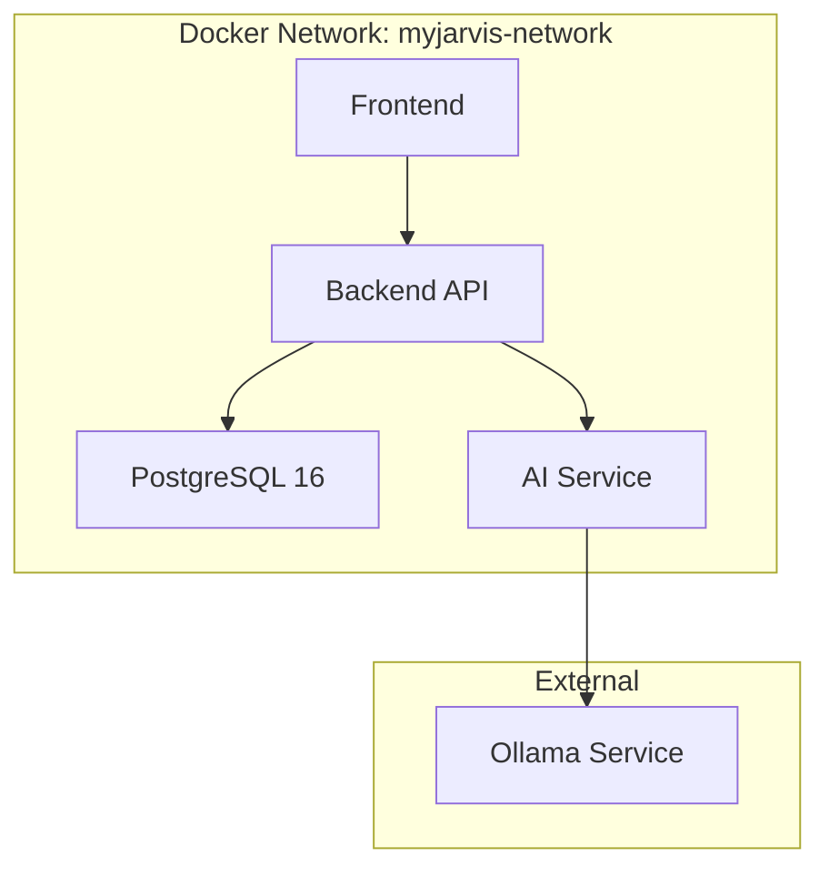

# myJarvis 詳細設計書

## 1. システム構成

### 1.1 コンテナ構成



### 1.2 技術スタック

| レイヤー | 技術 | バージョン | 説明 |
|---------|------|-----------|------|
| Frontend | React | 18.x | UI フレームワーク |
| | TypeScript | 5.x | 型安全な開発 |
| | Material-UI | 5.x | UIコンポーネント |
| | Socket.io-client | 4.x | WebSocket通信 |
| Backend | Node.js | 20.x | ランタイム |
| | Express | 4.x | Web フレームワーク |
| | Socket.io | 4.x | WebSocket サーバー |
| | Prisma | 5.x | ORM |
| | JWT | 9.x | 認証トークン |
| Database | PostgreSQL | 16 | リレーショナルDB |
| AI Service | Python | 3.11 | AI処理言語 |
| | FastAPI | 0.104.x | APIフレームワーク |
| | httpx | 0.25.x | HTTPクライアント |
| Infrastructure | Docker | 24.x | コンテナ化 |
| | Docker Compose | 3.9 | オーケストレーション |

## 2. データモデル

### 2.1 データベーススキーマ

```prisma
enum TaskStatus {
  TODO
  IN_PROGRESS
  DONE
}

enum TaskPriority {
  LOW
  MEDIUM
  HIGH
}

model User {
  id           String         @id @default(cuid())
  email        String         @unique
  name         String
  passwordHash String
  createdAt    DateTime       @default(now())
  updatedAt    DateTime       @updatedAt

  tasks         Task[]
  conversations Conversation[]
}

model Task {
  id          String       @id @default(cuid())
  title       String
  description String?
  status      TaskStatus   @default(TODO)
  priority    TaskPriority @default(MEDIUM)
  dueDate     DateTime?
  userId      String
  createdAt   DateTime     @default(now())
  updatedAt   DateTime     @updatedAt

  user User @relation(fields: [userId], references: [id], onDelete: Cascade)
}

model Conversation {
  id        String   @id @default(cuid())
  messages  Json
  userId    String
  createdAt DateTime @default(now())

  user User @relation(fields: [userId], references: [id], onDelete: Cascade)
}
```

## 3. API設計

### 3.1 REST API

#### 認証API

| メソッド | パス | 説明 | リクエスト | レスポンス |
|---------|------|------|-----------|-----------|
| POST | /api/v1/auth/register | ユーザー登録 | email, password, name | user, accessToken, refreshToken |
| POST | /api/v1/auth/login | ログイン | email, password | user, accessToken, refreshToken |
| POST | /api/v1/auth/refresh | トークン更新 | refreshToken | accessToken, refreshToken |

#### AI API

| メソッド | パス | 説明 | リクエスト | レスポンス |
|---------|------|------|-----------|-----------|
| POST | /api/v1/ai/chat | チャット処理 | messages, model, stream | choices (streaming/non-streaming) |
| GET | /api/v1/ai/models | 利用可能モデル | - | models[] |

### 3.2 WebSocket イベント

#### クライアント → サーバー

| イベント名 | 説明 | ペイロード |
|-----------|------|-----------|
| ai:chat | AI チャット開始 | message, model |
| chat:message | メッセージ送信 | text, userId, timestamp |
| chat:typing | タイピング通知 | userId, isTyping |

#### サーバー → クライアント

| イベント名 | 説明 | ペイロード |
|-----------|------|-----------|
| ai:response | AI レスポンス（ストリーミング） | choices[].delta.content |
| ai:complete | AI レスポンス完了 | - |
| ai:error | エラー通知 | message, code |
| chat:broadcast | メッセージブロードキャスト | text, userId, timestamp |

## 4. セキュリティ設計

### 4.1 認証・認可

- JWT (JSON Web Token) による認証
- Access Token (15分) と Refresh Token (7日) の二段階トークン
- bcrypt によるパスワードハッシュ化（salt rounds: 10）

### 4.2 入力検証

- Zod によるスキーマ検証
- メールアドレス形式検証
- パスワード強度チェック（8文字以上、大小文字、数字必須）

### 4.3 通信セキュリティ

- CORS 設定による不正なオリジンからのアクセス制限
- Helmet による一般的なセキュリティヘッダー設定
- Rate Limiting による過剰なリクエスト制限

## 5. エラーハンドリング

### 5.1 エラーコード体系

| コード範囲 | 説明 | 例 |
|-----------|------|-----|
| 400-499 | クライアントエラー | 400: Bad Request, 401: Unauthorized |
| 500-599 | サーバーエラー | 500: Internal Error, 503: Service Unavailable |
| AI_* | AI サービスエラー | AI_SERVICE_ERROR, AI_MODEL_NOT_FOUND |

### 5.2 エラーレスポンス形式

```json
{
  "error": "エラータイプ",
  "message": "ユーザー向けメッセージ",
  "code": "エラーコード（オプション）",
  "details": {}  // デバッグ情報（開発環境のみ）
}
```

## 6. パフォーマンス設計

### 6.1 データベース最適化

- インデックス設定
  - User: email (UNIQUE)
  - Task: [userId, status], [userId, dueDate]
  - Conversation: [userId, createdAt]

### 6.2 キャッシング戦略

- AI モデル一覧のメモリキャッシュ（TTL: 5分）
- WebSocket 接続プーリング

### 6.3 スケーリング考慮

- Dockerコンテナによる水平スケーリング対応
- PostgreSQL による本番環境対応
- WebSocket の Redis Adapter 対応準備（将来実装）

## 7. テスト戦略

### 7.1 テスト種別

| 種別 | 対象 | ツール | カバレッジ目標 |
|------|------|--------|-------------|
| 単体テスト | Backend | Jest | 80% |
| | Frontend | Jest + React Testing Library | 70% |
| | AI Service | pytest | 80% |
| 統合テスト | API | Supertest | 主要フロー100% |
| E2Eテスト | 全体 | Playwright | クリティカルパス100% |

### 7.2 テスト環境

- テスト用データベース: PostgreSQL (Docker)
- モックサーバー: MSW (Mock Service Worker)
- CI/CD: GitHub Actions（将来実装）

## 8. デプロイメント

### 8.1 環境構成

| 環境 | 用途 | インフラ |
|------|------|---------|
| Development | 開発 | Docker Compose (ローカル) |
| Staging | 検証 | Docker Compose (AWS EC2) |
| Production | 本番 | Kubernetes (AWS EKS) |

### 8.2 環境変数管理

- 開発環境: .env ファイル
- 本番環境: AWS Secrets Manager
- Docker Compose による環境変数注入

## 9. 監視・ロギング

### 9.1 ロギング

- Winston によるログ管理
- ログレベル: error, warn, info, debug
- ログローテーション設定

### 9.2 メトリクス（将来実装）

- Prometheus によるメトリクス収集
- Grafana によるダッシュボード
- アラート設定（PagerDuty連携）

## 10. 今後の拡張計画

### フェーズ5（計画中）
- Redis によるセッション管理
- WebSocket のスケーラビリティ向上
- マルチテナント対応

### フェーズ6（構想）
- 音声入力対応
- プラグインシステム
- モバイルアプリ開発