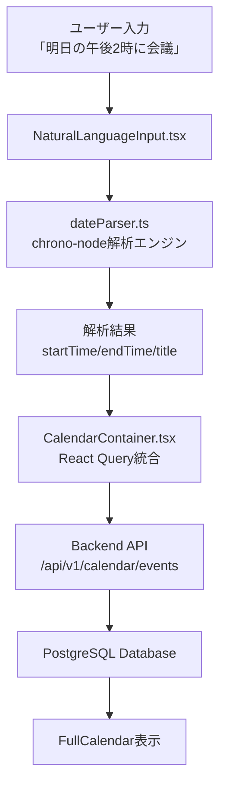

# 自然言語カレンダー機能設計書

## 概要

myJarvisプロジェクトのPhase 2Bとして実装された、日本語自然言語によるカレンダーイベント作成機能の技術設計書です。

## システム構成



## コンポーネント設計

### 1. 自然言語解析エンジン (`dateParser.ts`)

#### 主要機能
- **日本語テキスト解析**: chrono-node.jaを使用
- **イベントタイトル抽出**: 日時表現を除去してタイトルを生成
- **エラーハンドリング**: 解析失敗時の適切なエラーメッセージ

#### インターフェース定義
```typescript
export interface ParsedEvent {
  title: string;
  startTime: Date;
  endTime: Date;
  description?: string;
}

export interface ParseResult {
  success: boolean;
  event?: ParsedEvent;
  error?: string;
  originalText: string;
}

export function parseNaturalLanguageEvent(
  text: string,
  referenceDate?: Date
): ParseResult
```

#### 解析ロジック
1. **日時解析**: chrono.ja.parse()による日時抽出
2. **期間推定**: 終了時間未指定時は1時間後をデフォルト設定
3. **タイトル抽出**: 正規表現による日時表現の除去
4. **助詞処理**: 「に」「で」「の」等の日本語助詞の適切な処理

#### サポート表現例
```javascript
const SUPPORTED_EXPRESSIONS = [
  '明日の午後2時に会議',
  '来週の金曜日の10時から12時まで研修',
  '3月15日の朝9時に歯医者',
  '今度の日曜日に家族との食事',
  '来月の第2火曜日の午後3時に定期検診',
  '明後日の夕方5時にミーティング'
];
```

### 2. 自然言語入力UI (`NaturalLanguageInput.tsx`)

#### 設計原則
- **リアルタイムフィードバック**: 解析結果の即座表示
- **ユーザビリティ重視**: 使用例の提示とワンクリック入力
- **エラー対応**: 分かりやすいエラーメッセージと修正案

#### UI構成要素
```typescript
interface NaturalLanguageInputProps {
  onEventCreate: (event: EventData) => void;
  disabled?: boolean;
}
```

1. **入力フィールド**: 複数行対応のTextField
2. **解析ボタン**: リアルタイム解析トリガー
3. **結果表示エリア**: 成功時のプレビュー、エラー時の修正案
4. **使用例チップ**: クリックで自動入力される例文集
5. **作成ボタン**: 解析成功時に有効化

#### UXフロー
```
1. ユーザーがテキスト入力
2. 「解析」ボタンクリック or Enterキー
3. 解析結果をプレビュー表示
4. 確認後「イベント作成」ボタンクリック
5. カレンダーに反映
```

### 3. カレンダー統合 (`CalendarContainer.tsx`)

#### 統合ポイント
```typescript
const handleNaturalLanguageCreate = (eventData: {
  title: string;
  description?: string;
  startTime: string;
  endTime: string;
  color?: string;
}) => {
  createEventMutation.mutate(eventData);
};
```

#### データフロー
1. **入力**: 自然言語テキスト
2. **解析**: dateParser.tsによる構造化
3. **検証**: フロントエンドでの妥当性チェック
4. **送信**: React QueryによるAPI呼び出し
5. **更新**: ローカル状態とキャッシュの更新
6. **表示**: FullCalendarでの視覚的反映

## 技術仕様

### 依存関係
```json
{
  "chrono-node": "^2.9.0",
  "@fullcalendar/react": "^6.1.19",
  "@fullcalendar/daygrid": "^6.1.19",
  "@fullcalendar/timegrid": "^6.1.19",
  "@fullcalendar/interaction": "^6.1.19"
}
```

### パフォーマンス要件
- **解析速度**: < 100ms（通常の入力長）
- **UIレスポンス**: < 50ms（入力フィールドの反応性）
- **メモリ使用量**: 追加 < 10MB（chrono-node含む）

### 対応ブラウザ
- Chrome 90+
- Firefox 88+
- Safari 14+
- Edge 90+

## API仕様

### バックエンドエンドポイント
```typescript
// POST /api/v1/calendar/events
interface CreateEventRequest {
  title: string;
  description?: string;
  startTime: string; // ISO 8601 format
  endTime: string;   // ISO 8601 format
  color?: string;    // Hex color code
}

interface CreateEventResponse {
  id: string;
  userId: string;
  title: string;
  description?: string;
  startTime: string;
  endTime: string;
  category: string;
  color: string;
  location?: string;
  isAllDay: boolean;
  recurrenceRule?: string;
  createdAt: string;
  updatedAt: string;
}
```

## エラーハンドリング

### 解析エラー分類
1. **入力エラー**: 空文字、スペースのみ
2. **日時認識エラー**: 日時表現が検出されない
3. **解析エラー**: chrono-nodeの内部エラー
4. **妥当性エラー**: 過去の日時、論理的矛盾

### エラーメッセージ設計
```typescript
const ERROR_MESSAGES = {
  EMPTY_INPUT: 'テキストが入力されていません',
  NO_DATE_FOUND: '日時を認識できませんでした',
  PARSE_ERROR: '解析中にエラーが発生しました',
  INVALID_DATE: '有効な日時を入力してください'
};
```

## テスト戦略

### ユニットテスト (`dateParser.test.ts`)
- **基本解析機能**: 17のテストケース
- **エッジケース**: エラーハンドリング
- **パフォーマンス**: 解析速度の測定

### 統合テスト
- **API連携**: バックエンドとの通信
- **UI操作**: ユーザーインタラクションのシミュレーション
- **状態管理**: Zustandストアの動作確認

### E2Eテスト（将来実装）
- **フルフロー**: 入力から表示までの完全なワークフロー
- **ブラウザ互換性**: 複数ブラウザでの動作確認

## セキュリティ考慮事項

### 入力サニタイゼーション
- **XSS対策**: HTMLエスケープ処理
- **インジェーション対策**: SQLインジェクションの防止
- **入力長制限**: DoS攻撃の防止

### データ検証
- **フロントエンド**: TypeScript + Zodによる型検証
- **バックエンド**: Zodスキーマによる入力検証
- **データベース**: Prismaによる型安全なアクセス

## 運用・監視

### ログ出力
```typescript
// 解析成功時
console.log('Parse success:', {
  originalText,
  extractedTitle,
  startTime,
  endTime
});

// 解析失敗時
console.warn('Parse failed:', {
  originalText,
  error: errorMessage
});
```

### メトリクス収集（将来実装）
- **解析成功率**: 日次・週次での集計
- **よく使われる表現**: ユーザー行動分析
- **エラー傾向**: 改善点の特定

## 拡張計画

### Phase 3での拡張予定
1. **AI統合**: より高度な文脈理解
2. **スマート補完**: 過去の入力履歴からの学習
3. **多言語対応**: 英語、中国語等への拡張
4. **音声入力**: Web Speech APIとの統合

### パフォーマンス最適化
1. **キャッシュ機能**: よく使われる解析結果のキャッシュ
2. **遅延読み込み**: chrono-nodeの動的ロード
3. **ワーカー活用**: Web Workerでの解析処理

## 結論

この自然言語カレンダー機能は、ユーザビリティとパフォーマンスのバランスを取った実装となっています。chrono-nodeの強力な解析能力と、Material-UIによる直感的なUIの組み合わせにより、日本語ユーザーにとって使いやすいカレンダーシステムが実現されました。

将来のAI統合に向けた基盤としても機能し、myJarvisプロジェクトの重要なマイルストーンとなっています。