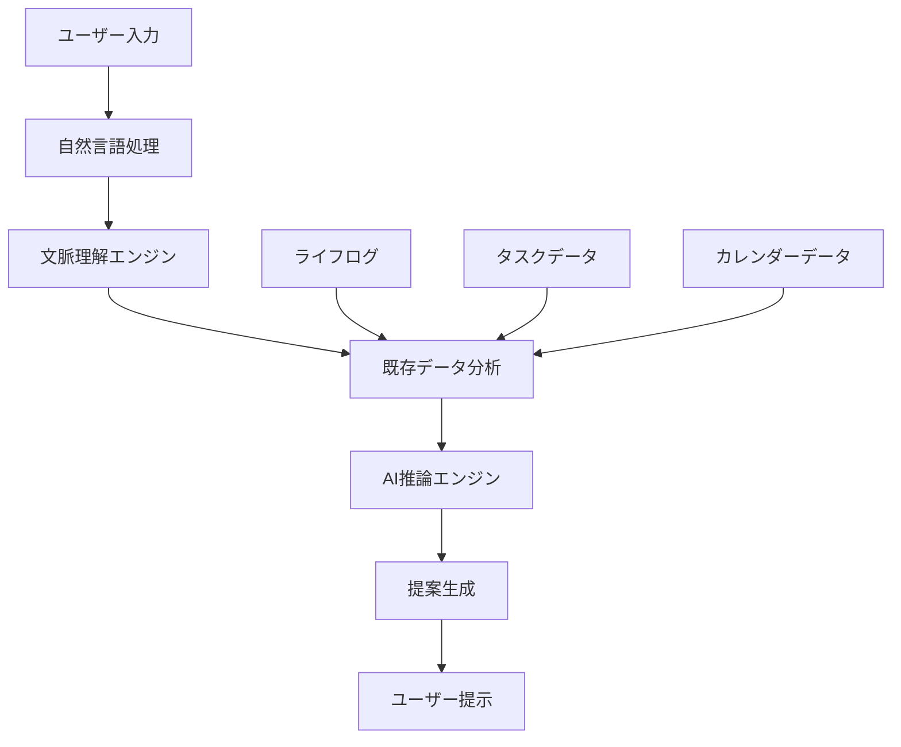

# myJarvis Phase 3 開発ロードマップ

## 📅 実装期間: 2025年9月28日〜 (Phase 2完了後)

## 🎯 Phase 3の目標

Phase 2で実装されたカレンダー機能と自然言語入力機能を基盤として、myJarvisを実用的なパーソナルアシスタントに進化させる。認証システムの実装とAI統合により、パーソナライズされた体験を提供する。

## ⚠️ 現在の課題と修正事項

### 即座に解決すべき問題
1. **外部キー制約エラー**: カレンダーAPIでのユーザーID参照エラー
2. **ポート競合**: フロントエンドが8081で起動（要求は8080）
3. **認証システム**: test-userによる仮実装の解消

## 📋 Phase 3実装計画

### 🔴 Priority 1: 認証システム実装 (Week 1-2)

#### 1.1 JWT認証基盤
- **実装内容**:
  - JWT認証ミドルウェア
  - ユーザー登録/ログインAPI
  - パスワードハッシュ化（bcrypt）
  - リフレッシュトークン機能

- **技術スタック**:
  - jsonwebtoken
  - bcryptjs
  - secure-session

#### 1.2 フロントエンド認証
- **実装内容**:
  - ログイン/登録フォーム
  - 認証状態管理（Zustand）
  - ルート保護（React Router）
  - 認証永続化（localStorage/sessionStorage）

#### 1.3 セキュリティ強化
- **実装内容**:
  - CORS設定の最適化
  - レート制限
  - セッション管理
  - CSRF対策

### 🟠 Priority 2: AI統合機能 (Week 3-4)

#### 2.1 スマートスケジューリング
- **実装内容**:
  - 既存のタスクとカレンダーを分析
  - AIによる最適なスケジュール提案
  - 時間ブロック自動調整
  - 優先度に基づく配置

#### 2.2 文脈理解エンジン
- **実装内容**:
  - ライフログからの文脈抽出
  - 過去のパターン学習
  - 個人の傾向分析
  - 予測的タスク提案

#### 2.3 高度自然言語処理
- **現在の基盤**: chrono-node解析
- **拡張内容**:
  - 複雑な文脈の理解
  - 曖昧な表現の解釈
  - タスクの自動分類
  - 感情解析との連携

### 🟡 Priority 3: ユーザーエクスペリエンス向上 (Week 5-6)

#### 3.1 音声入力対応
- **実装内容**:
  - Web Speech API統合
  - 音声→テキスト変換
  - 音声でのカレンダー入力
  - ハンズフリー操作

#### 3.2 通知システム
- **実装内容**:
  - リアルタイム通知（WebSocket）
  - ブラウザ通知API
  - カスタマイズ可能な通知設定
  - スマート通知タイミング

#### 3.3 データ分析・洞察
- **実装内容**:
  - 生産性ダッシュボード
  - 時間使用パターン分析
  - 目標達成率可視化
  - 改善提案機能

## 🏗️ 技術アーキテクチャ

### バックエンド拡張
```typescript
// 新規追加予定のAPI
/api/v1/auth/*           // 認証関連
/api/v1/ai/*            // AI機能
/api/v1/analytics/*     // 分析機能
/api/v1/notifications/* // 通知機能
```

### フロントエンド拡張
```typescript
// 新規コンポーネント
src/components/Auth/           // 認証UI
src/components/AI/             // AI機能UI
src/components/Analytics/      // 分析ダッシュボード
src/components/Notifications/  // 通知管理
```

### AI統合アーキテクチャ


## 🧪 テスト戦略

### Phase 3テスト要件
1. **認証システム**: セキュリティテスト重点
2. **AI機能**: 精度とパフォーマンステスト
3. **統合テスト**: 全機能連携テスト
4. **E2Eテスト**: ユーザーシナリオテスト

### テストカバレッジ目標
- 認証関連: 95%+
- AI機能: 90%+
- UI統合: 85%+

## 📊 成功指標 (KPI)

### 機能指標
- 認証成功率: 99.5%+
- AI提案精度: 80%+
- レスポンス時間: <500ms
- 自然言語解析精度: 90%+

### ユーザー体験指標
- ダッシュボード読み込み: <2秒
- 音声入力レスポンス: <1秒
- 通知配信成功率: 99%+

## 🔒 セキュリティ考慮事項

### データ保護
- 個人データ暗号化
- アクセスログ監査
- セッション管理強化
- API認証強化

### プライバシー保護
- ローカルデータ処理優先
- AI分析での匿名化
- データ保持期間制限
- ユーザー制御機能

## 🚀 リリース計画

### Phase 3.1: 認証システム (Week 1-2)
- 基本認証機能
- セキュリティ基盤
- ユーザー管理

### Phase 3.2: AI統合 (Week 3-4)
- スマートスケジューリング
- 文脈理解機能
- 高度自然言語処理

### Phase 3.3: UX向上 (Week 5-6)
- 音声入力
- 通知システム
- 分析ダッシュボード

## 🔄 継続的改善

### フィードバックループ
1. ユーザー行動分析
2. AI精度測定
3. パフォーマンス監視
4. セキュリティ監査

### 次期Phase準備
- モバイル対応検討
- 外部サービス連携
- チーム機能拡張
- エンタープライズ向け機能

---

## 🎯 Phase 3完了時の目標状態

**myJarvisが真のパーソナルアシスタントとして機能し、ユーザーの日常生活を能動的にサポートする基盤が完成している状態**

- ✅ セキュアな認証による個人データ保護
- ✅ AIによる学習・提案機能
- ✅ 直感的な音声・自然言語操作
- ✅ リアルタイム通知とアラート
- ✅ 生産性向上のための分析機能

---

*このロードマップは継続的に更新され、ユーザーフィードバックと技術進歩に応じて調整されます。*