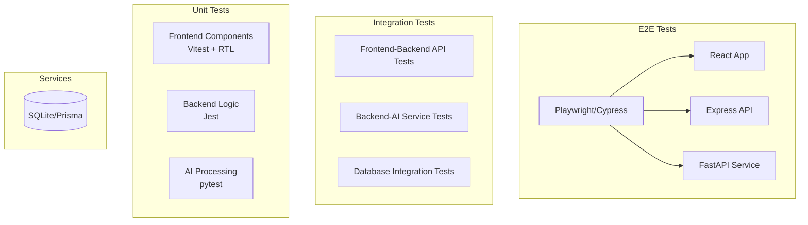

# テスティングアーキテクチャ設計書

## 概要
本ドキュメントは、myJarvisプロジェクトのテスト戦略と実装状況を定義する。

## テスト哲学
t-wadaのTDD原則に基づき、以下の方針を採用：
- **テストファースト**: コード実装前にテストを書く
- **Red-Green-Refactor**: 失敗→成功→改善のサイクル
- **テストはドキュメント**: 実行可能な仕様書として機能

## アーキテクチャ図



## 現在の実装状況 (2024-09-26)

### 🔴 Red段階完了

#### Backend Service
| テストファイル | テスト数 | 状態 | カバレッジ |
|--------------|---------|------|-----------|
| health.test.ts | 3 | 🔴 0/3 | 0% |
| auth.test.ts | 8 | 🔴 0/8 | 0% |
| **合計** | **11** | **🔴 0/11** | **0%** |

#### Frontend Service
| テストファイル | テスト数 | 状態 | カバレッジ |
|--------------|---------|------|-----------|
| App.test.tsx | 4 | 🔴 Error | 0% |
| TaskCard.test.tsx | 8 | 🔴 Error | 0% |
| **合計** | **12** | **🔴 0/12** | **0%** |

#### AI Service
| テストファイル | テスト数 | 状態 | カバレッジ |
|--------------|---------|------|-----------|
| test_health.py | 3 | 🔴 2/3 失敗 | - |
| test_ai_processing.py | 6 | 🔴 6/6 失敗 | - |
| **合計** | **9** | **🔴 1/9** | **11%** |

### テスト実行コマンド

```bash
# Backend
cd backend && npm test

# Frontend
cd frontend && npm test

# AI Service
cd ai-service && pytest

# カバレッジ付き実行
npm run test:coverage  # Backend/Frontend
pytest --cov  # AI Service
```

## テストデータ管理

### フィクスチャ構成
```
tests/
├── fixtures/
│   ├── users.json       # ユーザーテストデータ
│   ├── tasks.json       # タスクテストデータ
│   └── schedules.json   # スケジュールテストデータ
├── mocks/
│   ├── prisma.ts        # Prismaクライアントモック
│   ├── ollama.py        # Ollamaサービスモック
│   └── api.ts           # APIレスポンスモック
└── utils/
    ├── setup.ts         # テストセットアップ
    └── helpers.ts       # テストヘルパー関数
```

## モック戦略

### Backend
```typescript
// Prismaモック例
jest.mock('@prisma/client', () => ({
  PrismaClient: jest.fn().mockImplementation(() => ({
    user: {
      create: jest.fn(),
      findUnique: jest.fn(),
    }
  }))
}));
```

### Frontend
```typescript
// APIモック例
global.fetch = vi.fn(() =>
  Promise.resolve({
    ok: true,
    json: async () => ({ data: 'mocked' })
  })
);
```

### AI Service
```python
# Ollamaモック例
@pytest.fixture
def mock_ollama(monkeypatch):
    def mock_generate(*args, **kwargs):
        return {"text": "mocked response"}
    monkeypatch.setattr("ollama.generate", mock_generate)
```

## CI/CD統合計画

### GitHub Actions ワークフロー
```yaml
name: Test Pipeline
on: [push, pull_request]

jobs:
  backend-tests:
    runs-on: ubuntu-latest
    steps:
      - uses: actions/checkout@v3
      - run: cd backend && npm ci && npm test

  frontend-tests:
    runs-on: ubuntu-latest
    steps:
      - uses: actions/checkout@v3
      - run: cd frontend && npm ci && npm test

  ai-service-tests:
    runs-on: ubuntu-latest
    steps:
      - uses: actions/checkout@v3
      - run: cd ai-service && pip install -r requirements.txt && pytest
```

## 次のステップ

### 🟢 Green段階（実装予定）
1. **Backend**: ヘルスチェック・認証エンドポイント実装
2. **Frontend**: Appコンポーネント・TaskCard実装
3. **AI Service**: FastAPIエンドポイント実装

### 🔵 Refactor段階（将来計画）
1. コード重複の除去
2. パフォーマンス最適化
3. テストヘルパー関数の共通化

### 📊 メトリクス目標
- ユニットテストカバレッジ: 80%
- 統合テストカバレッジ: 60%
- ビルド時間: 5分以内
- テスト実行時間: 3分以内

## リスクと対策

| リスク | 影響度 | 対策 |
|-------|--------|------|
| テストの脆弱性 | 高 | Page Objectパターン採用 |
| 実行時間の増加 | 中 | 並列実行、キャッシュ活用 |
| フレークテスト | 高 | リトライ機構、安定化 |
| モックの複雑化 | 中 | ファクトリーパターン採用 |

## 参考資料
- [Jest Documentation](https://jestjs.io/)
- [Vitest Documentation](https://vitest.dev/)
- [pytest Documentation](https://docs.pytest.org/)
- [t-wada TDD Boot Camp](https://github.com/twada/tdd-boot-camp)